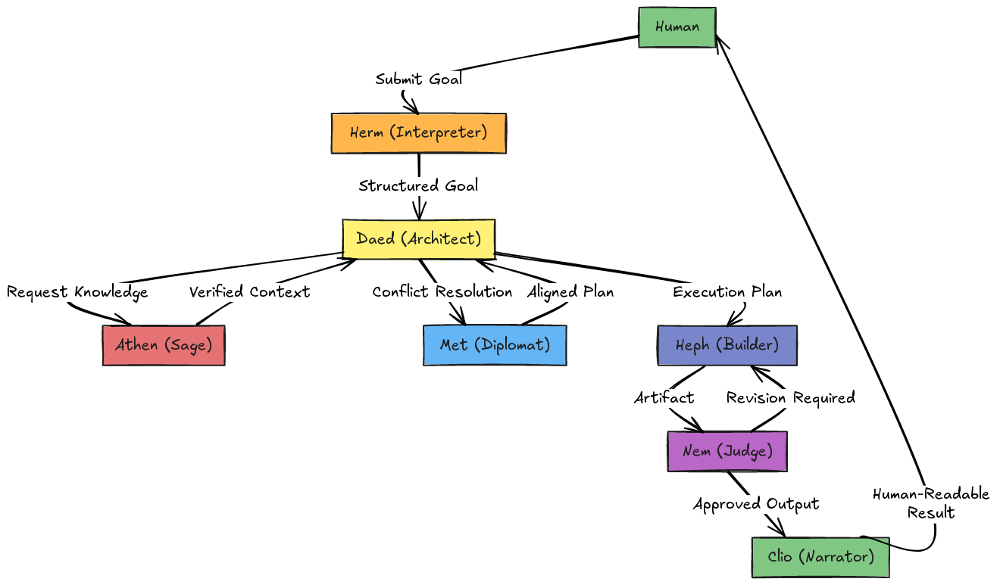

# Symposion Architecture

Symposion is a collaborative multi-agent framework that treats goal completion as a structured dialogue among specialized agents. A human submits a goal; agents interpret it, plan it, enrich it with context, deliberate on choices, build deliverables, evaluate outcomes, and finally narrate results in a human-readable format.

---

## Core Concepts

### Roles, Not One Big Agent
Symposion is built around role specialization. Each agent is optimized for a narrow set of tasks. Coordination happens through explicit messages and a shared task state.

### A Pipeline With Feedback Loops
The system is a pipeline with explicit gates (agents):
Herm → Daed → Athen → Met → Heph → Nem → Clio

### Transparency & Human Readability
All major decisions and outputs should be observable, logged, and explainable.

---

## Message Interface

```json
{
  "sender": "string",
  "recipient": "string",
  "task_id": "string",
  "intent": "string",
  "content": "string",
  "goal_reference": "string",
  "urgency": "LOW | NORMAL | HIGH | CRITICAL"
}
```

Field Summary:
* sender — Origin of the message (agent or human)
* recipient — Target agent that should process it
* task_id — Unique ID for this task instance
* intent — Purpose of the message (plan, build, evaluate, etc.)
* content — The payload (instructions, artifacts, feedback)
* goal_reference — Stable ID linking all related tasks to one goal
* urgency — Priority for scheduling (does not affect logic)

Design rules:
- All coordination is explicit via messages
- Messages should be loggable and replayable
- goal_reference is stable across revisions

---

## Message Intents

`intent` defines *why* a message exists and what the recipient is expected to do.  
It is the primary driver of agent behavior.

---

### Goal & Intake Intents

- **NEW_GOAL**  
  A human or system introduces a new goal.

- **CLARIFY_GOAL**  
  Request for clarification about a goal.

- **GOAL_CLARIFICATION**  
  Response containing clarifications.

- **STRUCTURED_GOAL**  
  Herm’s structured interpretation of a goal.

- **UPDATE_GOAL**  
  Modify scope, constraints, or success criteria.

---

### Planning Intents (Daed)

- **PLAN_REQUEST**  
  Ask Daed to generate a plan.

- **TASK_DECOMPOSITION**  
  Break a goal into subtasks.

- **PLAN_PROPOSAL**  
  Proposed plan for review or alignment.

- **PLAN_APPROVED**  
  Plan accepted for execution.

- **REPLAN_REQUEST**  
  Trigger replanning due to failure or rejection.

---

### Research & Context Intents (Athen)

- **RESEARCH_REQUEST**  
  Request for information or context.

- **CONTEXT_BRIEF**  
  Summary of relevant knowledge.

- **FACT_CHECK**  
  Request to verify claims.

- **FACT_RESULT**  
  Verified or corrected information.

---

### Alignment & Negotiation Intents (Met)

- **ALIGNMENT_CHECK**  
  Confirm agents agree on direction.

- **CONFLICT_NOTICE**  
  Signal disagreement.

- **CONSENSUS_REQUEST**  
  Ask Met to mediate.

- **CONSENSUS_DECISION**  
  Final decision after mediation.

- **ESCALATION_NOTICE**  
  Human or higher-level escalation.

---

### Execution Intents (Heph)

- **BUILD_TASK**  
  Instruction to create something.

- **EXECUTION_START**  
  Signal that building has begun.

- **ARTIFACT_BUILT**  
  Deliverable produced.

- **ARTIFACT_UPDATE**  
  Revised deliverable.

- **EXECUTION_COMPLETE**  
  Task finished.

---

### Evaluation Intents (Nem)

- **EVALUATE_OUTPUT**  
  Request evaluation.

- **QUALITY_CHECK**  
  Explicit quality review.

- **REVISION_REQUEST**  
  Output needs changes.

- **REJECTION_NOTICE**  
  Output rejected.

- **APPROVED_OUTPUT**  
  Output accepted.

---

### Reporting Intents (Clio)

- **STATUS_UPDATE**  
  Progress report.

- **SUMMARY_REQUEST**  
  Ask for a summary.

- **FINAL_REPORT**  
  Human-readable final result.

- **EXPLANATION**  
  Rationale for decisions.

---

### System & Control Intents

- **HEARTBEAT**  
  Agent alive signal.

- **ERROR_NOTICE**  
  Something failed.

- **TASK_BLOCKED**  
  Progress cannot continue.

- **TASK_CANCELLED**  
  Task terminated.

- **TASK_COMPLETE**  
  Task lifecycle finished.

- **LOG_ENTRY**  
  Structured logging message.

---

## Design Note

Not all systems need every intent at v1.  
Start small and expand as workflows mature.


## Primary Data Objects

### Goal
A structured representation of user intent:
- objective
- constraints
- success criteria
- assumptions
- deliverable type

### Plan
A set of ordered or dependent subtasks.

### Artifact
Any deliverable produced by Heph:
text, code, files, or docs.

### Evaluation
Nem’s verdict:
APPROVED / REVISION_REQUIRED / REJECTED

---

## Agent Responsibilities



### Herm (Interpreter)
Translates human goals into structured goals.

### Daed (Architect)
Breaks goals into executable plans.

### Athen (Sage)
Gathers and verifies knowledge.

### Met (Diplomat)
Resolves disagreements and aligns decisions.

### Heph (Builder)
Executes tasks and produces artifacts.

### Nem (Judge)
Evaluates outputs for quality and alignment.

### Clio (Narrator)
Communicates outcomes to humans.

---

## Execution Flow

1) Human → Herm  
2) Herm → Daed  
3) Daed ↔ Athen (as needed)  
4) Conflicts → Met  
5) Daed → Heph  
6) Heph → Nem (mandatory)  
7) Nem → Approve or Revise  
8) Final → Clio  

---

## Revision Loop

Heph builds → Nem evaluates → revisions if needed.
Limit revision cycles and escalate to replanning when stuck.

---

## Orchestration Strategy

### v0
Single-process orchestrator, in-memory state, synchronous calls.

### v1
Service-based agents, message broker, persistent storage, dashboard.

---

## Observability

- Log all messages
- Store artifacts by task_id
- Record Nem verdicts
- Maintain a task timeline

---

## Security Notes

- Sandbox risky actions
- Avoid logging secrets
- Support human override for destructive tasks

---

## Definition of Done

Symposion works when:
- Goals flow end-to-end Human → Clio
- Message trails are visible
- Nem can enforce revisions
- Outputs are usable and clear
